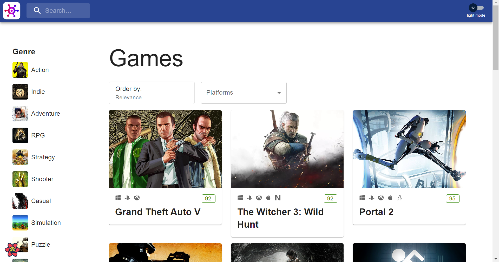
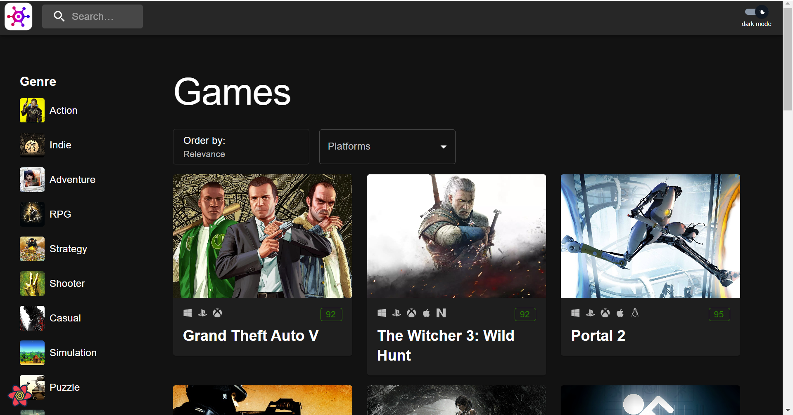

## Game Catalog

<details>
  <summary>Table of Contents</summary>
  <ol>
    <li>
      <a href="#about-the-project">About The Project</a>
      <ul>
        <li><a href="#built-with">Built With</a></li>
      </ul>
    </li>
    <li>
      <a href="#getting-started">Getting Started</a>
      <ul>
        <li><a href="#prerequisites">Prerequisites</a></li>
        <li><a href="#installation">Installation</a></li>
      </ul>
    </li>
    <li><a href="#usage">Usage</a></li>
    <li><a href="#contact">Contact</a></li>
  </ol>
</details>

### About The Project



This game catalog serves as a centralized and organized collection of information about various games. It can be used in several ways:

- Users can explore the catalog to discover new games based on genres, platforms, release dates, or other criteria.
- Filters and search functionality allow users to find games that match their preferences.
- Each game entry in the catalog provides detailed information about the game, including its description, genre, platform, metascore and publisher.
- Dark Mode feature is also available in the game catalog to reduce eye strain.



#### Built With

- React
- TypeScript
- Material UI

### Getting Started

#### Prerequisites

- install yarn
- node v18.8.0

#### Installation

1. Clone the repo
   ```sh
   git clone git@github.com:ValeriaTrofim/game-catalog.git
   ```
2. Install yarn packages
   ```sh
   yarn
   ```
3. Get the API Key from https://rawg.io/apidocs

4. Create a .env file and add the API Key

   ```sh
   VITE_RAWG_BASE_URL="https://api.rawg.io/api"
   VITE_RAWG_API_KEY=""
   ```

### Usage

- Axios -
  Instance configured to interact with the "https://api.rawg.io/api" base URL, and it includes the API key as a default parameter for all requests. This instance can be used to make API calls to the RAWG Video Games Database API with the specified configurations.
- React Context -
  The context setup allows the application to share and update theming information across different components without the need for prop drilling. The components that need access to theme-related information can subscribe to this context, ensuring a centralized and consistent theming experience across the application. For the same reason the context was implemented in the search funcionality. It was used to provide a mechanism for components within the application to access and update the gameQuery state without having to pass it down through props manually.
- Custom hooks and react-query -
  The custom hooks are part of the React application and are designed to fetch data from an API using the React Query library. Each hook is responsible for fetching a specific type of data related to games, such as platforms, genres, game details, screenshots, and a paginated list of games based on a given query. These hooks encapsulate the logic for fetching specific types of data from an API, providing a clean and reusable way to manage data fetching and state within the Game Catalog. They leverage the features of the React Query library to handle caching, automatic refetching, and other aspects of data management. Components in the application can use these hooks to retrieve the necessary data and render UI components based on the fetched information.
- Material UI -
  Using Material-UI in a React application involves integrating the Material Design components provided by the library into React components.It also provides built-in support for theming, including the ability to implement dark mode.Material-UI Grid system was utilised for the responsive layout design.

### Contact

Valeria Trofim - valeria.trofim17@gmail.com

Project Link: [https://github.com/ValeriaTrofim/game-catalog](https://github.com/ValeriaTrofim/game-catalog)
